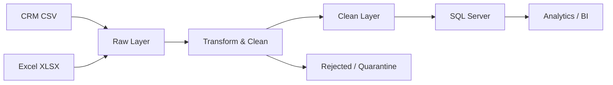

# CRM Customer Data ETL Pipeline

An ETL pipeline that consolidates fragmented customer data from multiple sources (CRM exports, Excel spreadsheets) into a single clean, analysis-ready SQL table — eliminating duplicates, inconsistent formats, and data gaps.

---

## Simplified Workflow



**ETL Flow:** Sources → Raw → Transform → Clean → SQL → Analytics

---

## What the Pipeline Does

- Extracts customer records from CSV (CRM export) and Excel (.xlsx) files
- Standardises column names, date formats, phone formats, and text casing
- Deduplicates records by `CustomerID` (one canonical record per customer)
- Filters out null-key and invalid rows (sent to `rejected/` or `quarantine/`)
- Merges both sources into a single unified stream
- Loads clean data into `dbo.Customers` in SQL Server for downstream reporting

---

## Tech Stack

| Tool | Role |
|---|---|
| **Azure Data Factory** | Pipeline orchestration |
| **ADF Data Flow** | Visual transformations (merge, clean, deduplicate) |
| **Azure Blob Storage** | Hosts raw source files and clean output |
| **SQL Server / Azure SQL** | Target database for clean customer records |
| **Apache Airflow** | Scheduling and workflow monitoring |
| **Excel / CSV** | Source data formats |
| **Git / GitHub** | Version control |

---

## Project Structure

```
customer-data-etl/
├── data/
│   ├── raw/           ← Drop source files here (never edit)
│   ├── clean/         ← Pipeline writes processed output here
│   ├── rejected/      ← Rows that fail validation
│   └── quarantine/    ← Problem files awaiting review
├── sql/
│   └── scripts/       ← Numbered SQL scripts (tables, views, procedures)
├── adf/
│   ├── pipelines/     ← ADF pipeline JSON exports
│   ├── datasets/      ← ADF dataset JSON exports
│   └── linked_services/ ← ADF connection JSON exports
├── docs/              ← Project guide and phase tracking
├── wiki/              ← Full project documentation
├── presentation/      ← Demo slides and screenshots
└── .github/           ← CI/CD workflows and PR/issue templates
```

---

## How to Run

```bash
# 1. Clone the repository
git clone https://github.com/Ali-Hegazy-Ai/CAI4_AIS5_S11_P2.git
cd CAI4_AIS5_S11_P2

# 2. Install dependencies
pip install -r requirements.txt

# 3. Place source files in data/raw/ then run the pipeline
python run_pipeline.py
```

---

## Data Quality Handling

| Layer | Contents |
|---|---|
| `data/raw/` | Original source files — never modified |
| `data/clean/` | Validated, transformed, analysis-ready records |
| `data/rejected/` | Rows that failed validation rules (e.g. null key) |
| `data/quarantine/` | Files or records with unresolved issues pending review |

---

## Orchestration

- **Azure Data Factory** — runs the core ETL pipeline (`pl_customer_etl`): copy → transform → load
- **Apache Airflow** — schedules pipeline runs and monitors task-level success/failure

---

## More Details

- Full documentation: [`wiki/`](wiki/Home.md)
- Pipeline phases and progress: [`docs/project_flow.md`](docs/project_flow.md)
- Setup guide, data validation queries, SQL schema, and contributing guide are all in the wiki.
